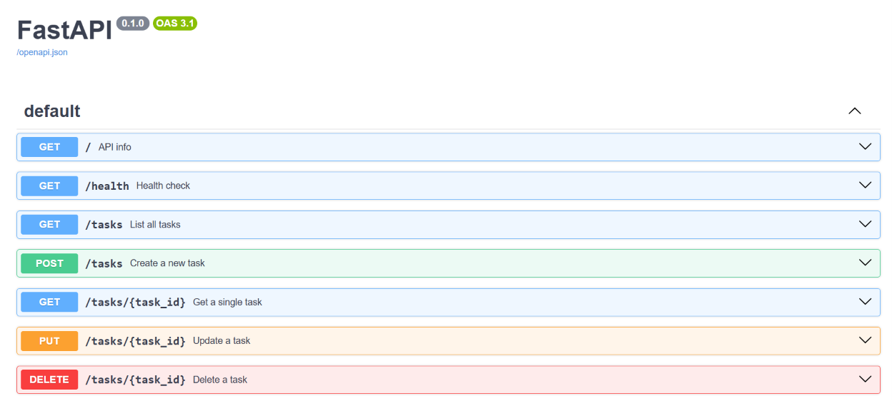
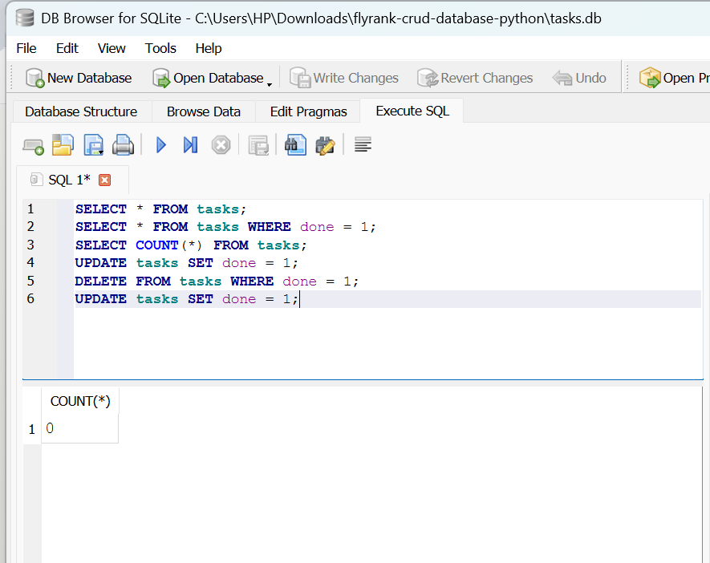

# Task API

A lightweight CRUD API for managing a to-do list, built with Python and FastAPI. This project was built as part of FlyRank AI's Backend Engineering internship (Week 2, Assignment 1), and covers the full create-read-update-delete cycle with proper validation and status codes.It was later extended in Week 3 to use a real SQLite database instead of in-memory storage.

## Features

- Full CRUD operations on tasks, stored in a SQLite database
- Input validation with clear error responses
- Interactive API documentation via Swagger UI
- Tested through both curl and Swagger UI

## Getting Started

Requirements: Python 3.10+

1. Install dependencies:

   pip install fastapi uvicorn

2. Run the server:

   uvicorn main:app --reload

3. The API will be available at http://localhost:80004. On first run, a `tasks.db` file is created automatically, with 3 example tasks

## Endpoints

| Method | Path | Description |
|---|---|---|
| GET | / | API info |
| GET | /health | Health check |
| GET | /tasks | List all tasks |
| GET | /tasks/{id} | Get a single task |
| POST | /tasks | Create a new task |
| PUT | /tasks/{id} | Update a task |
| DELETE | /tasks/{id} | Delete a task |

## Example Request

curl -i -X POST http://localhost:8000/tasks -H "Content-Type: application/json" -d "{\"title\":\"Buy milk\"}"

HTTP/1.1 201 Created
content-type: application/json

{"id":4,"title":"Buy milk","done":false}

## Interactive Docs

FastAPI automatically generates interactive documentation at /docs, where every endpoint can be tested directly in the browser.

## Database

This project uses SQLite instead of an in-memory list, so task data survives server restarts.

**Why SQLite:** It requires no separate database server or installation, just a single file, making it ideal for a small project like this while still using real SQL, and it comes built into Python's standard library.

**Database file:** `tasks.db`, created automatically in the project folder the first time the app runs. The table is also created automatically if it doesn't exist, and 3 example tasks are inserted only if the table is empty.

**Example query, run directly in DB Browser for SQLite:**

    SELECT * FROM tasks WHERE done = 1;

## Data Persistence

Unlike the earlier in-memory version of this project, task data now survives server restarts, since it is stored in `tasks.db` rather than a Python list. Restarting the server no longer clears existing tasks; the 3 example tasks are only inserted on the very first run, when the table is empty.

## What I Learned

Building this project deepened my understanding of the full CRUD cycle, how a server handles reading, creating, updating, and deleting data, and how status codes (200, 201, 204, 400, 404) communicate outcomes clearly. I also learned how Pydantic models handle validation, and how path parameters allow a single route to serve many different resources.Extending it with SQLite taught me how an API layer and a data layer are genuinely separate, changes made directly in the database, completely outside my Python code, were immediately reflected through the API. I also learned how to write basic SQL queries (SELECT, INSERT, UPDATE, DELETE) and use parameterized queries to insert data safely.

## AI vs Me

For this section, I wrote my own prompt from memory and asked an AI to build the same API. Its code is saved separately in the ai-version folder so it does not mix with my hand-built code.

### My Prompt

Ok so you need to make a to-do-list API using Python and the framework should be FastAPI. So I will divide your work into 6 stages. Before that, let me tell you that we will only be using 4 tools of HTTP (GET, POST, PUT, and DELETE). In stage 0, use GET with just "/" and return "Hello World" or any basic line. In stage 1, I want you to return name, version, and endpoints when the endpoint "/" is used with GET, and for GET with "/health", I want you to return the status as "ok". In stage 2, add three tasks in a variable, and for GET with "/tasks", you should get all the tasks. For GET with "/tasks/{task_id}", you should get the specified task, and throw error 404 if the task is not found for the specified id. In stage 3, I want you to throw error 400, which means the title is required, when the user does not enter the title. If the user enters the title, add it to a task and append it to the tasks list. Set done to false here. Assign the next id automatically. If it gets posted successfully, throw 201, which means it was successfully created. In stage 4, update and delete the task. If the task the user is asking for is not found, throw error 404. Remember to throw the errors as JSON responses. If it is successfully deleted, throw 204 for success. In stage 5, add Swagger UI. It will be created automatically, so you just need to go to the browser and type http://localhost:8000/docs.

### What the AI did better

The AI's version listed all 7 endpoints in the "/" response, while mine only listed one. It also passed a title, version, and description into the FastAPI app itself, which makes the Swagger docs page look more polished, something my own code does not do.

### What it got wrong or ignored

The AI's create endpoint only checked if the title was missing or empty, not if it was just whitespace. My own hand-built code already guarded against whitespace-only titles, so this was one place where my version was stricter than the AI's first attempt.

### What my prompt forgot to specify

I never told the AI what should go inside the endpoints list on the root route, so it decided on its own to list all 7 endpoints. I also never asked for summaries or descriptions on each route, but the AI added them anyway to improve the Swagger docs.

### The Rematch

For the second attempt, I updated my prompt to explicitly ask for all 7 endpoints in the list, to reject whitespace-only titles, and to add summaries to every endpoint. All three fixes worked correctly in the new version, and I confirmed the whitespace fix by testing it directly:

curl -i -X POST http://localhost:8000/tasks -H "Content-Type: application/json" -d "{\"title\":\"   \"}"

HTTP/1.1 400 Bad Request
content-type: application/json

{"error":"Title is required"}

One thing the rematch still missed: the whitespace check was only added to the create endpoint, not to the update endpoint, so a task's title could still be updated to just spaces through PUT. This showed that even a more detailed prompt does not guarantee the AI applies the same rule consistently across similar endpoints.